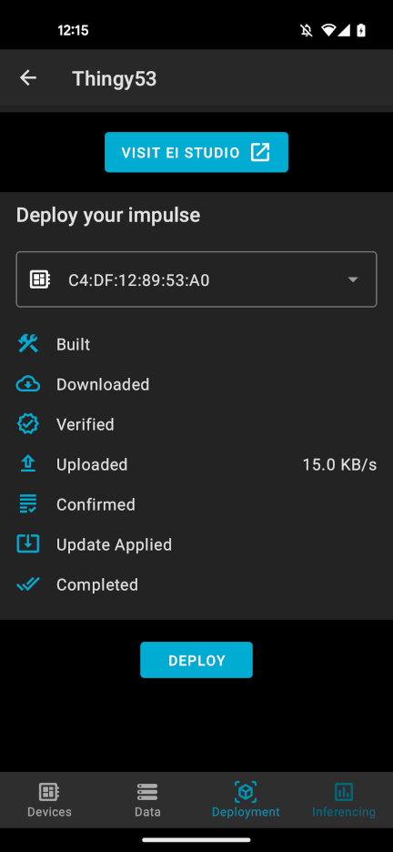

# Environmental Noise Classification with Edge Impulse and the Nordic Thingy:53

Noise pollution can be a significant problem especially in densely populated urban areas. It can have negative effects both humans and the wildlife. Also, noise pollution is often caused by power hungry activities, such as industrial processes, constructions, flights, etc.

A Noise Pollution Monitoring device built on top of the Nordic Thingy:53 development kit, with smart classification capabilities using Edge Impulse can be a good way to monitor this phenomenon in urban areas. Using a set of Noise Pollution Monitoring the noise / environmental pollution from a city can be monitored. Based on the measured data, actions can be taken to improve the situation. Activities causing noise pollution tend to also have a high energy consumption. Replacing this applications with more efficient solutions can reduce their energy footprint they have.

In this project I will demonstrate how a low power device like the Nordic Thingy:53 can be used in conjunction with an edge machine learning platform like Edge Impulse to build a smart noise / environmental pollution monitor. The PDM microphone of the Nordic Thingy:53 will be used to capture environmental noise. A digital signal processing (DSP) and Inference pipeline built using Edge Impulse will be used to classify audio samples of know activities like construction works, traffic and others.

### Getting Started with the Thingy:53

The Nordic Thingy:53 is comes with the pre-installed firmware, that allows us to easily create machine learning projects with Edge Impulse.

The [nRF Edge Impulse](https://play.google.com/store/apps/details?id=no.nordicsemi.android.nrfei) mobile app is used to interact with Thingy:53. The app also integrates the [Edge Impulse](https://www.edgeimpulse.com/) embedded machine learning platform.

To get started with the app we will need to create an Edge Impulse account, and a project:

After this we should be able to detect the Thingy:53 in the Devices tab. The thingy will show up as a device named EdgeImpulse.

Going to the Inference tab we can try out the pre-installed demo app, which uses the accelerometer data to detect 4 types of movement.

### Collecting Audio Data

The first step of building a machine learning model is to collect some training data.

For this proof-of-concept, I decided to go with 4 classes of sounds:

-   Silence - a silent room

-   Nature - sound of birds, rain, etc.

-   Construction - sounds from a construction site

-   Traffic - urban traffic sounds

A the source of the audio samples I used a number of Youtube videos, listed in the Resources section.

The audio sample can be collected from the Data tab of the nRF Edge Impulse app:

The audio samples are automatically uploaded to the Edge Impulse Studio project, and should show up in the Data Acquisition tab:

Initially all the samples will be put in the Train sample, so we will need to run a Train / Test split:

After this we should have approximately 80% of samples in the Train set, and 20% in the Test set:

### Training an Audio Classification Model

Having the audio data, we can start building a machine learning model.

In Edge Impulse project the machine learning pipeline is called an Impulse. An impulse includes the pre-processing, feature extraction and inference steps needed to classify, in our case audio data.

For this project I went will the following design:

-   Time Series Data  Input - with 1 second windows @ 16kHz

-   Audio (MFE) Extractor - this is the recommended feature extractor for non-voice audio

-   NN / Keras Classifier - a neural network classifier

-   Output with 4 Classes - Silence, Nature, Traffic, Construction

The impulse blocks were trained mostly with the default settings. The feature extraction block looks like follows:

This is followed by the classification block:

The resulting model is surprisingly good:

Most of the test samples were correctly classified. We only have a couple of mismatches for the Traffic / Construction and Silence / Nature classes. This is however expected, as these sounds can be pretty similar.

### Deploying the Model on the Thingy:53

Building an deploying an embedded application including machine learning use to in envolve a couple of steps. With the Thingy:53 and Edge Impulse this become much easier.

We just need to go to the Deployment tab, and hit Deploy. The model will automatically start building:

A couple of minutes later the model is built and deployed on our Thingy:53:

### Running Live Inference on the Thingy:53

The Deployment we did earlier should have been uploaded a firmware with the new model on the Thingy:53. Hitting Start on the Inference will start live classification on the device.

I tested the application out with new audio samples for each class:

### A Network of Devices

In future versions this project could be extended to also include features like:

-   Noise level / decibel measurement

-   Cloud connectivity via Bluetooth Mesh / Thread

-   Solar panel charging

A network of such monitoring devices could be used to monitor the noise / environmental pollution in a city. Based on the collected data high impact / polluting activities can be identified, and can be replaced with better alternatives.

### Resources

Edge Impulse Project:  
<https://studio.edgeimpulse.com/studio/146039>

Sound Sources:
- Construction:  
[10 Hours of Construction Sound | Amazing Sounds with Peter Baeten](https://www.youtube.com/watch?v=AB4Ov9t4aq4)  
[(Sunville Sounds)](https://www.youtube.com/watch?v=AB4Ov9t4aq4)  

- Nature:  
[Bird Watching 4K with bird sounds to relax and study | A day in the backyard](https://www.youtube.com/watch?v=KCl85UpJYZU) [(Sunville Sounds)](https://www.youtube.com/watch?v=KCl85UpJYZU)  
[Beautiful Afternoon In Nature With Singing Birds ~ Stories With Peter Baeten](https://www.youtube.com/watch?v=qvabR_rsfn0) [(Sunville Sounds)](https://www.youtube.com/watch?v=qvabR_rsfn0)  
[Gentle Rain Sounds on Window ~ Calming Rain For Sleeping & Relaxing | Rain Sounds with Peter Baeten](https://www.youtube.com/watch?v=AstZaueBF14) [(Sunville Sounds)](https://www.youtube.com/watch?v=AstZaueBF14)

- Traffic:  
[Busy Traffic Sound Effects](https://www.youtube.com/watch?v=-rvc63Ez6DM) [(All Things Grammar)](https://www.youtube.com/watch?v=-rvc63Ez6DM)  
[Heavy Traffic Sound Effects | Bike Riding in Traffic Roads Sounds | Zoom Hn1 Indian Roads FreeSounds](https://www.youtube.com/watch?v=tt-IbRmIwkM) [(To Know Everything)](https://www.youtube.com/watch?v=tt-IbRmIwkM)  
[City Traffic Sounds for Sleep | Highway Ambience at Night | 10 Hours ASMR White Noise](https://www.youtube.com/watch?v=fh3EdeGNKus) [(Nomadic Ambience)](https://www.youtube.com/watch?v=fh3EdeGNKus)