# Deploying Edge Impulse Models on ZEDEDA Cloud Devices

This project shows how we can deploy Edge Impulse based ML apps on devices managed by the ZEDEDA Cloud platform.

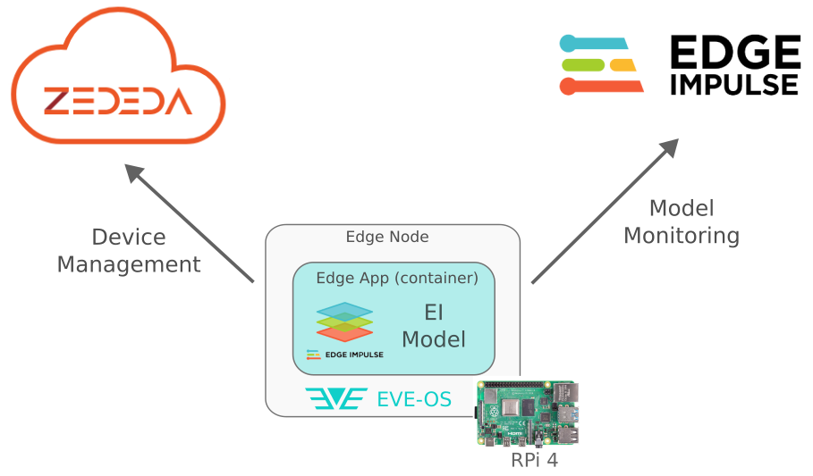

A Raspberry Pi 4 will be used as our Edge Device. First we will install EVE OS on it, then we will provision the Edge Device into the ZEDEDA Cloud platform.

Our Edge Impulse model will be then packaged as a container based ZEDEDA Edge App. This app will be deployed to our Edge Device.

Finally, we will show how the new Model Monitoring features can be used to monitor Edge Impulse models running on production devices.


## Edge Impulse

In this project we will focus on deploying Image / Video based Edge Impulse projects on ZEDEDA Cloud devices. We can use an existing Edge Impulse project, or create a new one.

For this demo I created a simple object detection project. First I collected a couple of images of a mug, a glass and a Raspberry Pi 4:
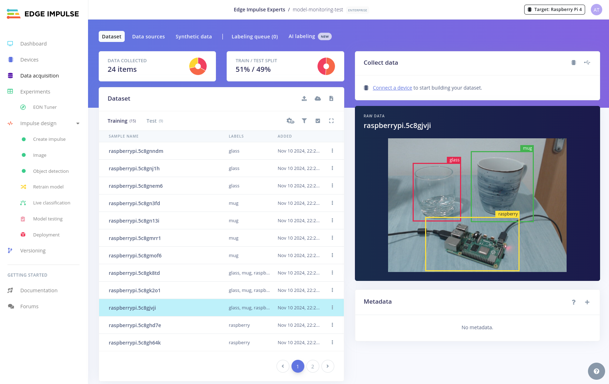

Then I build a impulse:
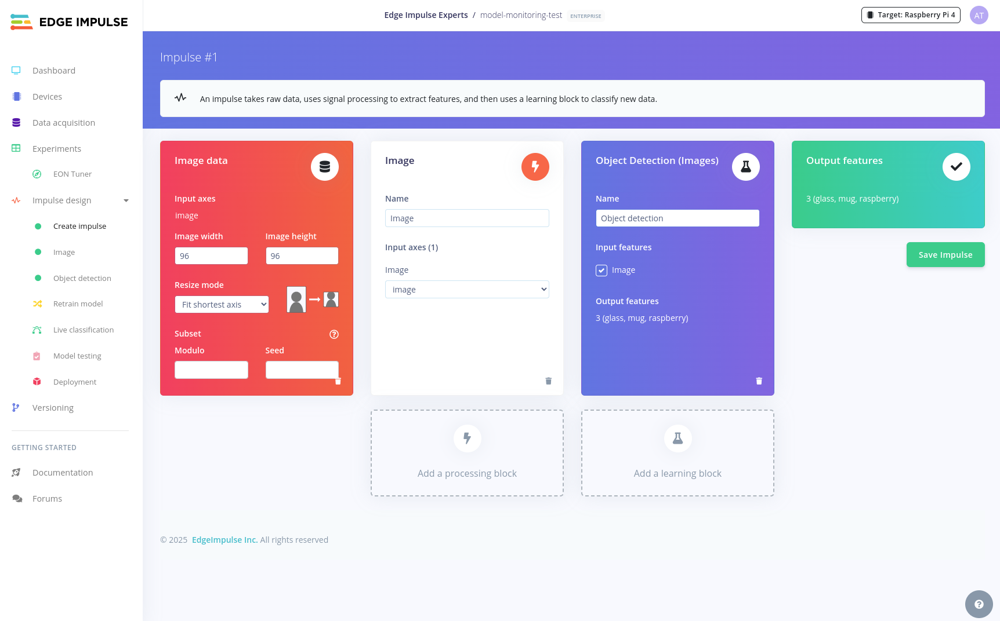

To deploy the Impulse on ZEDEDA Cloud / EVE OS devices we will need an API Key from the Edge Impulse Studio. We can get this from the Dashboard -> Keys section:

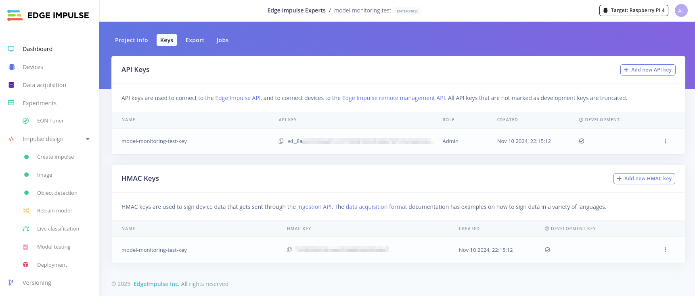

From here, copy the API Key's value with the `ei_...` format.

## ZEDEDA

Managing a high number of edge devices and applications can be challenging, and an orchestration platform is often needed to efficiently manage it. ZEDEDA provides such an edge orchestration platform in a SaaS offering.

The ZEDEDA cloud platform offers, along others, advanced edge device and app management features. In this project we will show how an Edge Impulse AI model can be deployed on a ZEDEDA managed edge devices.

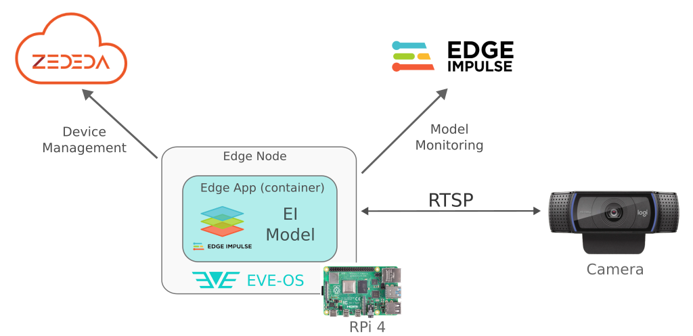

For the purpose of the demo we will use a Raspberry Pi 4 as our ZEDEDA Edge Node. The Edge Impulse AI model will be deployed to the platform as az Edge App. Additionally, Edge Impulse Model Monitoring will be used inspect the live running AI model directly from Edge Impulse Studio.

Hardware:
- a Raspberry Pi 4 model B, with at least 2GB of RAM
- a microSD card with at least 8GB capacity
- wired LAN connection with Internet access
- an IP camera or an USB webcam 
- (optional) a HDMI display and micro-HDMI to HDMI cable - these are only needed to view the debug output of EVE-OS

### Installing EVE-OS on a Raspberry Pi 4

Edge Nodes managed by the ZEDEDA cloud platform must run [EVE-OS](https://lfedge.org/projects/eve/), which is light-weight, open-source Linux distribution designed to run containerized or VM based workloads. In this section we will show how to install EVE-OS on a Raspberry Pi 4.

To install EVE-OS we need to generate and flash an SD Card image. This can be done using the [lfedge/eve](https://hub.docker.com/r/lfedge/eve) tool packaged as a Docker container.

The default settings create a EVE-OS image intended for production use. In case we are using a demo / trial account with ZEDEDA Cloud, we need to prepare a small customization the will point the EVE-OS installation to the ZEDEDA Demo server:
```sh
$ mkdir "$HOME/eve-overrides-demo"
$ echo zedcloud.gmwtus.zededa.net > "$HOME/eve-overrides-demo/server"
```

With this we are ready to generate an EVE-OS image by running the following command:
```sh
$ docker run -v "$HOME/eve-overrides-demo:/in" --rm lfedge/eve:latest-arm64 live > ./live.img

...
b5171159-734b-4254-9930-2c35239d3858     # <-- this is an uniquely generated soft serial number
```

The command produces a `live.img` with our EVE-OS image. Along this, there is uniquely generated soft serial number printed as the last line of the output. Make sure to note this, as it will be needed later in the provisioning step.

The resulting `live.img` should be a regular disk image file, and can flashed to the microSD card using [Balena Etcher](https://etcher.balena.io/) or similar tools.

After the SD card is flashed we can insert it to the Raspberry Pi 4. EVE OS should boot automatically. In case we have a HDMI display connected we will see some message with EVE-OS trying to connect to ZEDEDA Cloud.

### Creating an ZEDEDA Cloud Project

With having the Raspberry Pi 4 running EVE-OS, we can start setting up things in the ZEDEDA Cloud platform.

The first thing we need in ZEDEDA Cloud is a Project. To create it we go to [Administration -> Projects](https://zedcontrol.gmwtus.zededa.net/administration/projects/list) and click on Add Project:

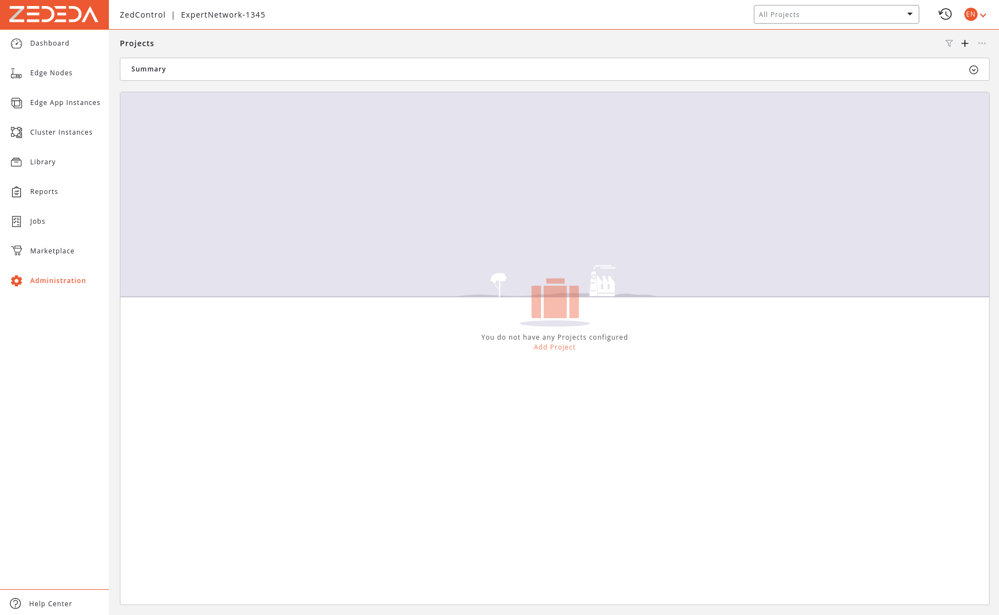

Next, give a name to the project and select "Deployment" type:
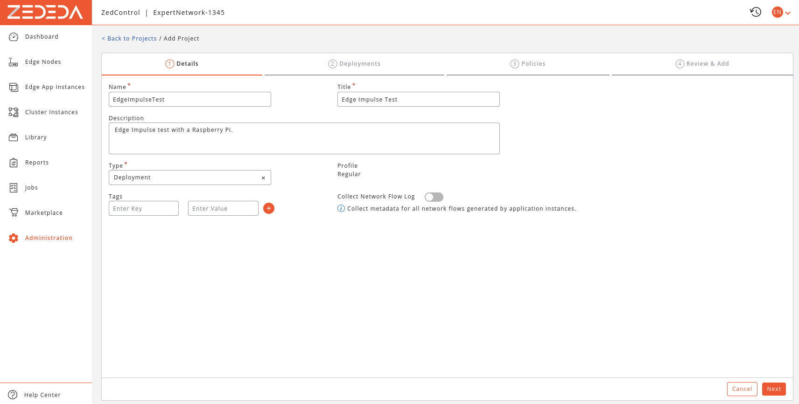

On the deployments and policies pages we can use the same name:
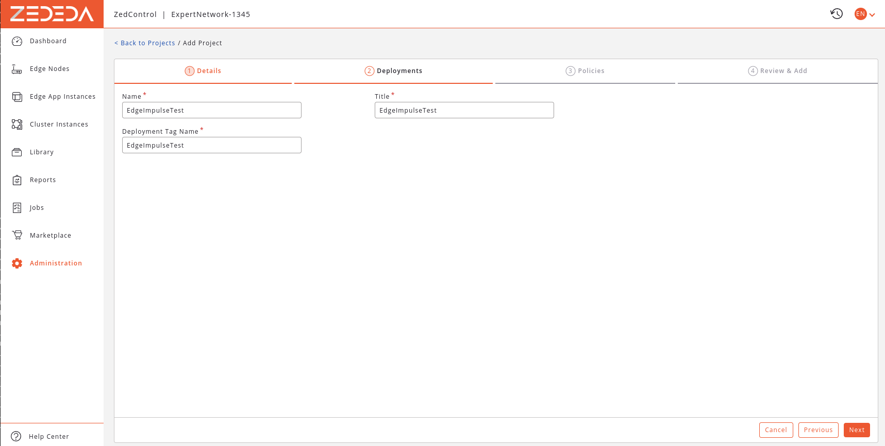

while keeping the rest of the options as defult:
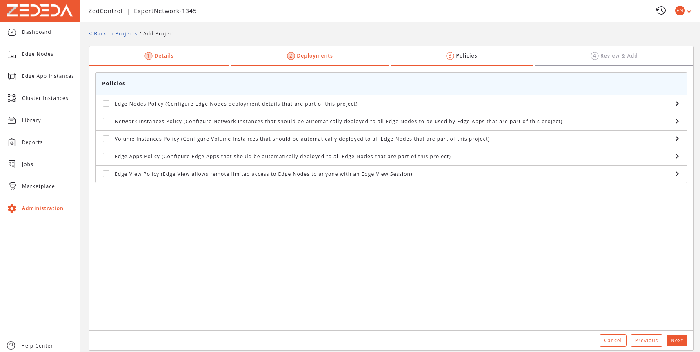

Lastly we can review out inputs and hit Next to create or project:
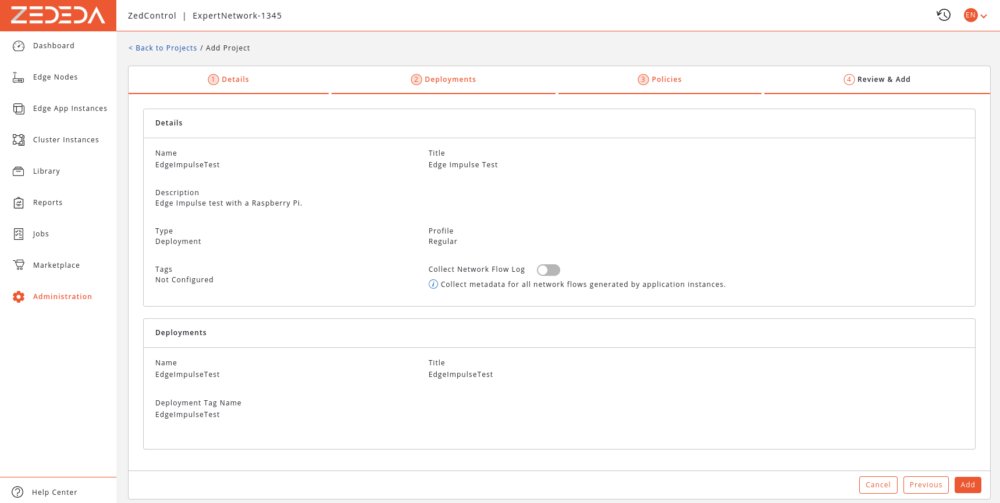

After the project is created, our Projects list should look something like this:
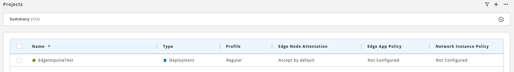

### Configuring a Network

Before onboarding the Raspberry Pi 4 we will need to configure the a network for the Edge Nodes to use. For this go to
[Library -> Networks](https://zedcontrol.gmwtus.zededa.net/library/networks/list) and hit Add Network.

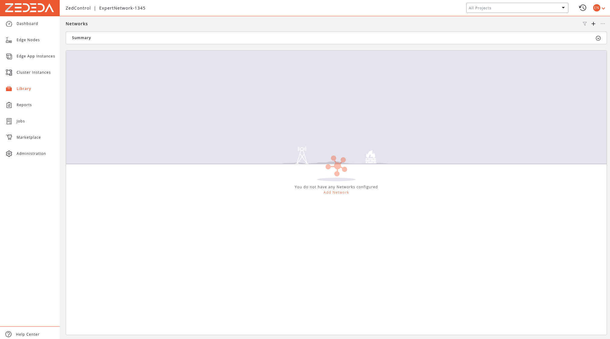

Here add a new IPv4 network with an arbitrary name, DHCP client mode and 1500 MTU:
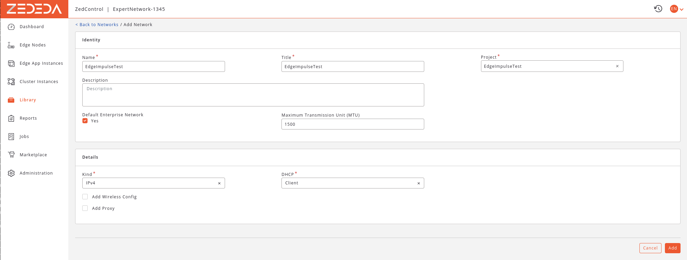

The newly added network should appear in the networks list:
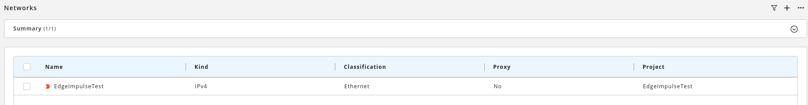


### Onboarding the Raspberry Pi 4 to ZEDEDA Cloud

At this point we should be ready to onboard our Raspberry Pi 4 into ZEDEDA Cloud.

If this is our first Edge Node we first need to import a supported hardware model from the ZEDEDA Marketplace. For this go to [MarketPlace -> Models](https://zedcontrol.gmwtus.zededa.net/marketplace/models/list), and in the Global Models section find a import the RPi4-4G model:
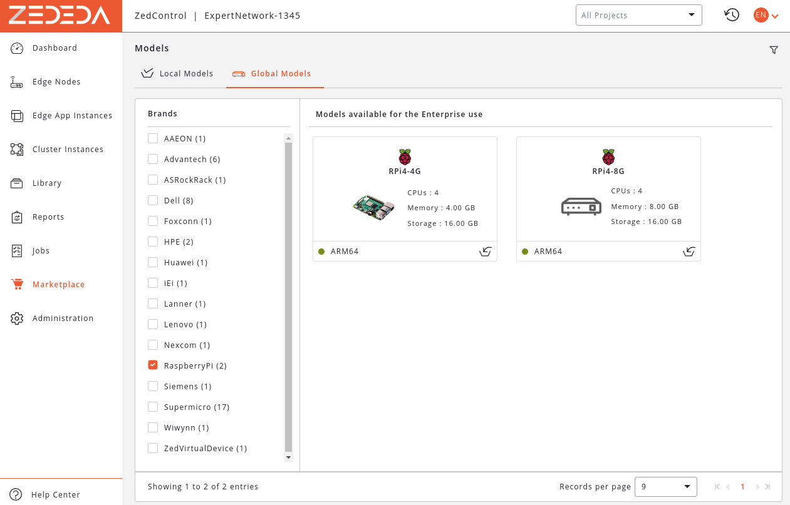

Next go to the [Edge Nodes](https://zedcontrol.gmwtus.zededa.net/edge-nodes/list) page, and click Add Edge Node.

Here we should give a name to the new node, and select our previously created Project and Deployment Tag:
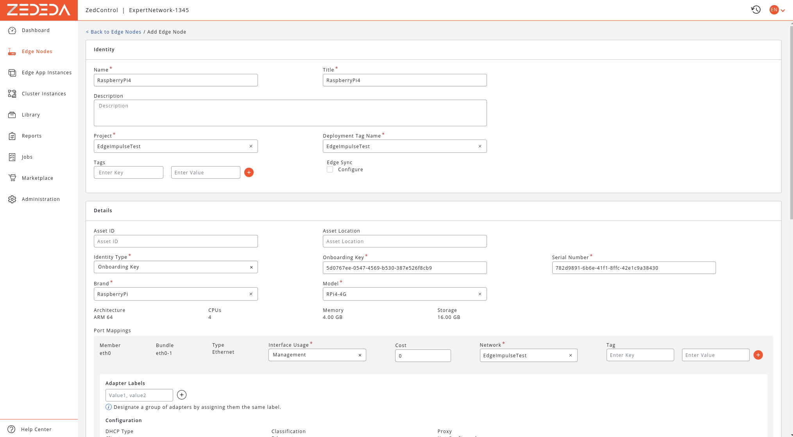

In the Details sections, select Onboarding Key as the Identity Type. Set the Onboarding Key to `5d0767ee-0547-4569-b530-387e526f8cb9`, which is the default key for all project). In the Serial Number field enter the unique serial number we got earlier at the generate EVE OS image step. For the Brand and Model select RaspberryPi and RPi-4G.

In the Port Mapping section set `eth0` as a Management interface, with our previously created Network attached to it. The `wlan0` network can be left Unused, while the USB port can be set as App Direct (we will not use them).

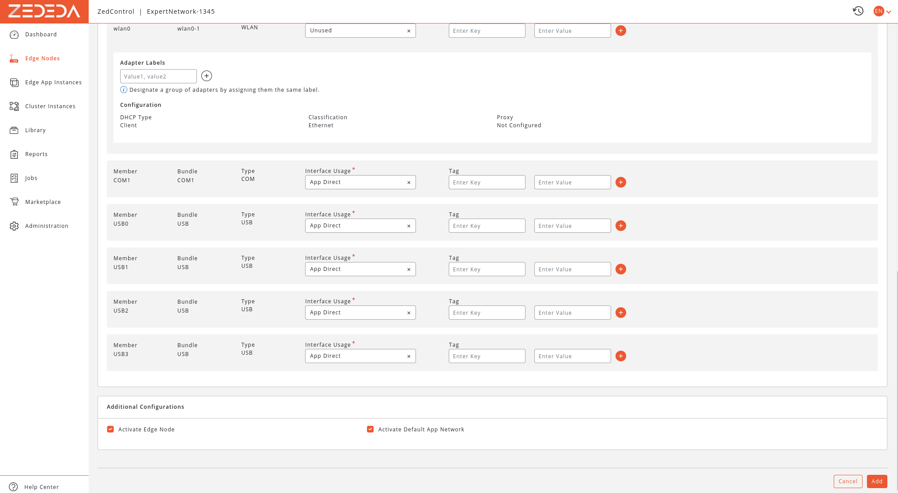

In the Additional Configuration section we can check both activation options.

After we hit Next the onboarding of the Edge Node will start. This can take a couple of minutes, after which we should find that our Edge Nodes becomes online:

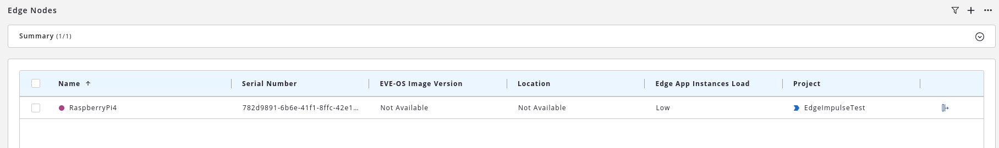

In the Edge Node's page we can find various details and metrics:
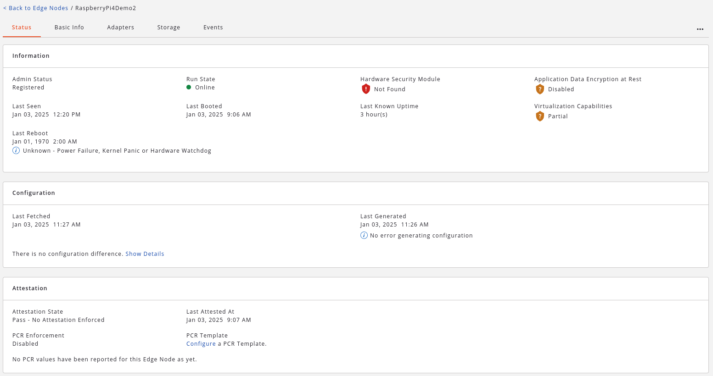

## Creating a Image / Video Project in Edge Impulse Studio

## Deploying the Edge Impulse Project to ZEDEDA


### Preparing and a Container Image

To run applications on ZEDEDA / EVE OS devices we need to package them as containers. 

Edge Impulse already packages the EI Runner as a Docker container, and we will use that as our base Docker image. Over that we will add two things:
1. A couple of GStreamer plugins to be able to use RTSP Camera as our video source (*TODO ZEDEDA / EVE OS does not seems to support USB cameras with the Raspberry Pi)
2. An entry point script that will start the EI runner


```docker
FROM aureleq/ei-inference-container

ARG DEBIAN_FRONTEND=noninteractive

RUN ln -snf /usr/share/zoneinfo/Europe/Bucharest /etc/localtime && echo Europe/Bucharest > /etc/timezone

RUN apt update -y && apt install -y gstreamer1.0-tools gstreamer1.0-plugins-good gstreamer1.0-plugins-base gstreamer1.0-plugins-base-apps gstreamer1.0-libav && apt dist-upgrade -y && apt autoremove -y && apt autoclean -y

ADD app.sh /app/app.sh
```

The `app.sh` is a script used as the container's entry point. It can start the Edge Impulse runner in two possible modes:
1. HTTP Server mode - starts an inference server on port `1337` 
2. RTSP Camera mode with Model Monitoring - starts an inference server with Model Monitoring enabled, with a RTSP Camera as the video source

```sh
#!/bin/bash

MODE="$1"
EI_API_KEY="$2"
DEVICE_NAME="$3"

echo "Mode: $MODE"
echo "EI API Key: $EI_API_KEY"

if [[ "$MODE" == "http-server" ]]; then
    echo "Running EI runner in HTTP server mode..."
    node /app/linux/node/build/cli/linux/runner.js --api-key "${EI_API_KEY}" --run-http-server 1337 --impulse-id 1

elif [[ "$MODE" == "gst-model-monitoring" ]]; then
    echo "Running EI runner with GStreamer sources + Model monitoring..."
    while true; do
       echo "${DEVICE_NAME}" | node /app/linux/node/build/cli/linux/runner.js --clean --silent --monitor --api-key "${EI_API_KEY}" --verbose --enable-camera --gst-launch-args "rtspsrc location=rtsp://<RTSP-CAM-IP>:8554/stream ! rtph264depay ! avdec_h264 ! videoconvert ! jpegenc" || true; 
       echo "Runner stopped! Restarting it..."
    done
else
    echo "Unknown mode!"
    exit 1;
fi
```

To be able to use this a container image from ZEDEDA Cloud, we need to make it available in a container repository. I used a private DockerHub repository for this purpose, and built the iamge
```sh
$ docker buildx build . --platform linux/arm64 --tag attitokes/zededa-test:edge-impulse-in-docker-0.1.0 --load
$ docker push attitokes/zededa-test:edge-impulse-in-docker-0.1.0
```


### Configuring the Container Registry and Adding the Container Image

As we will use a slightly modified container image, we will need to container registry that we can attach to ZEDEDA Cloud.  To attach a Docker Hub repository to ZEDEDA Cloud, go to [Library -> Data Stores](https://zedcontrol.gmwtus.zededa.net/library/data-stores/list), and hit + to create a new data store.

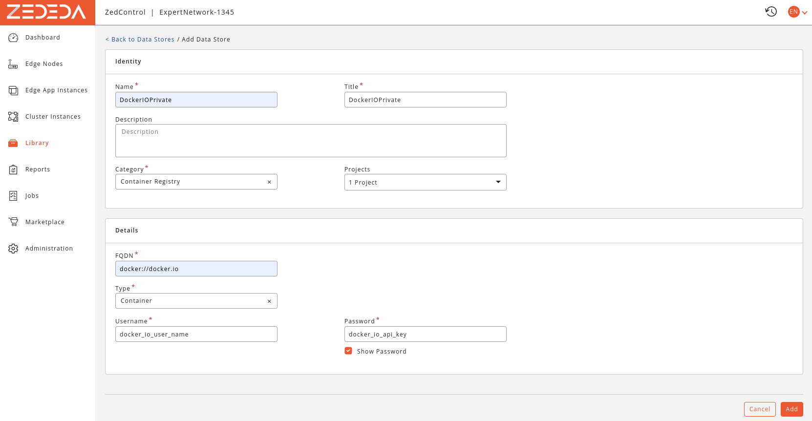

Give it a name, and select Container Registry as the Category. Use `docker://docker.io` as the FQDN, select the type Container, and enter your Docker IO user name and API key.

After this we should be able to import our container image into ZEDEDA. For this go to [Library -> Edge App Images](https://zedcontrol.gmwtus.zededa.net/library/images/app/list), and hit + to add a new image:

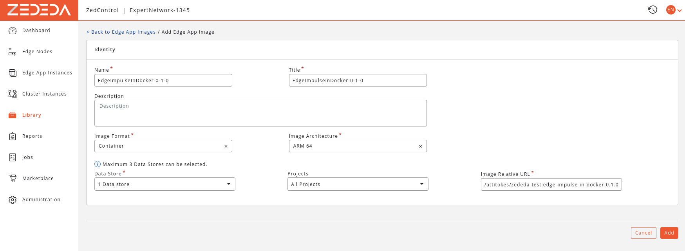

Here select the newly added Data Store, specify the image URL using the `/<username>/<image>:<tag>` format.

### Creating and Edge App

With this we are ready to package our EI models as an ZEDEDA Edge App. For this go to [Marketplace -> Edge Apps](https://zedcontrol.gmwtus.zededa.net/marketplace/edge-apps/local/list), and create a new edge app. Select Container as the application type.

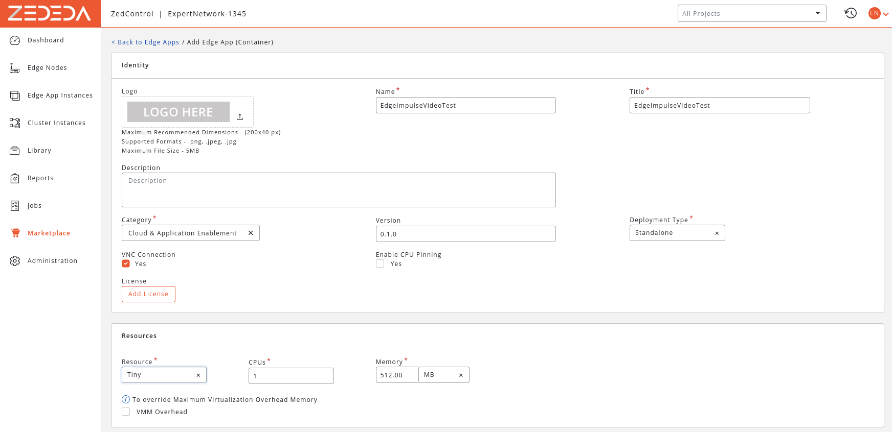

In the Add Edge App page give the application a name, and select Standalone as the Deployment Type.For Resources Tiny or Small should be good enough.

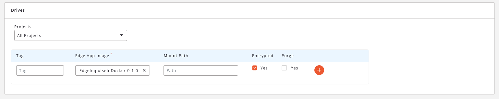

In the Drives sections select the the Edge App Image we created previously:

Then, in the Networking section we need to configure an Outbound rules that allows any traffic:
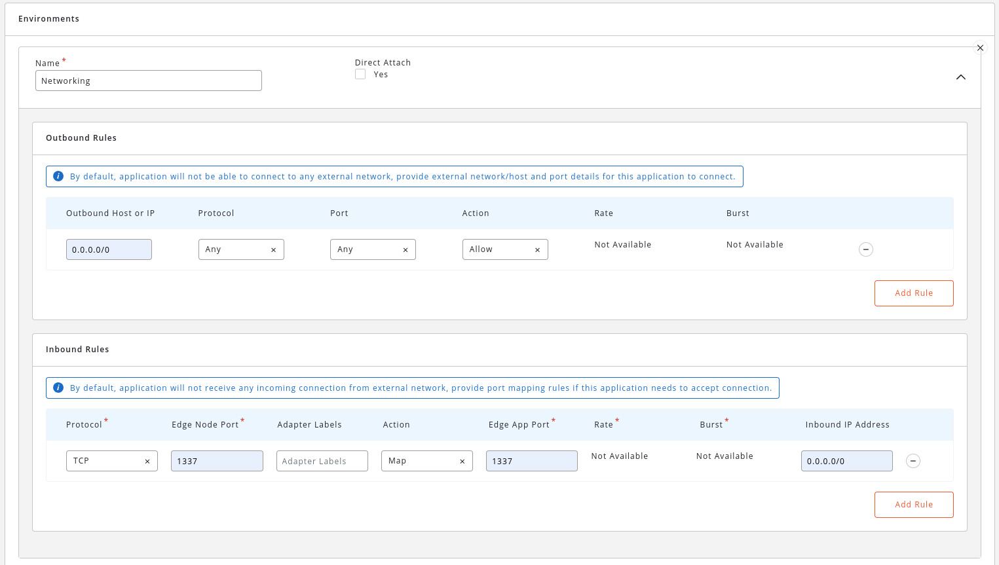

Additionally, if we want to use the HTTP server, we also need to expose the `1337` port to the outside world.

In the Configurations enable to custom edge app configuration as follows:
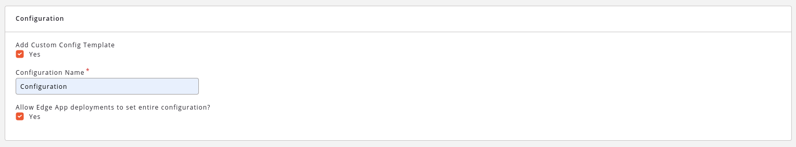

This will allow us to inject settings like the Device name and Edge Impuse API Key later when we deploy the Edge App to the Raspberry Pi 4.

On the Developer Info section fill up the necessary details, and hit add to create the Edge App.
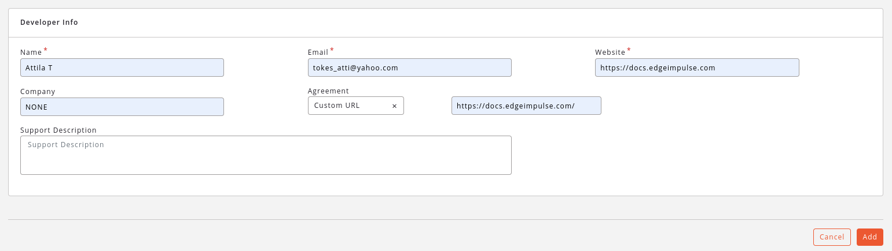

### Deploying the Edge App to the Raspberry Pi 4

With the Edge App create, we should be able deploy it to our Raspberry Pi 4 Edge Node. To do this go to the [Edge App Instances](https://zedcontrol.gmwtus.zededa.net/edge-app-instances/list) section, and use the + button to create a new deployment:

In the first page select the Raspberry Pi 4 Edge Node to deploy to:
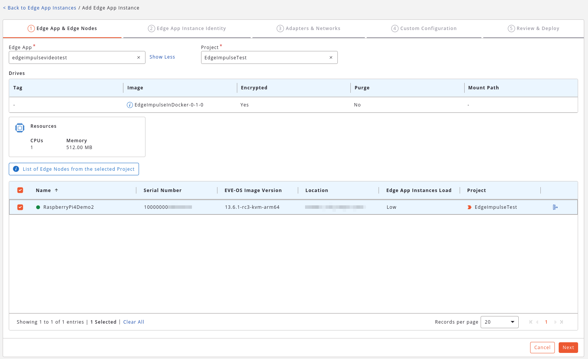

Then, in the next page, give the app instance a name:
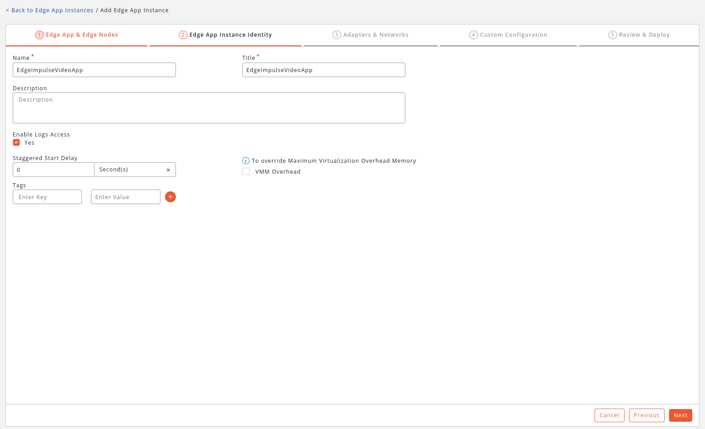

In the next page, the Networking settings should be already pre-populated with the correct adapter, so we can go the next page:
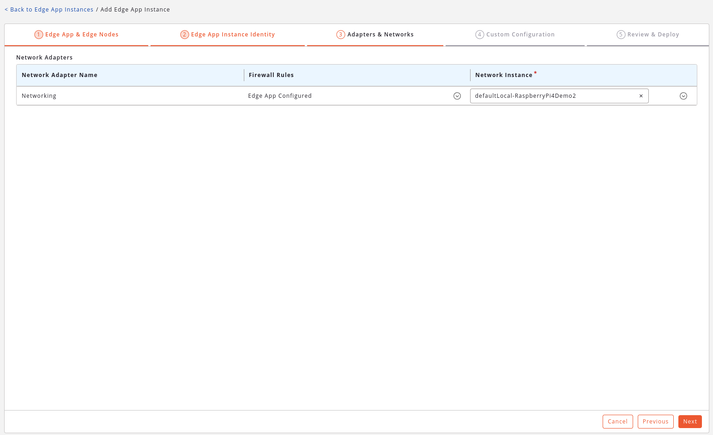

The next page we can configure the settings for our Edge App instance. Here we can give specify a Device Name and our Edge Impulse API Key as follows:
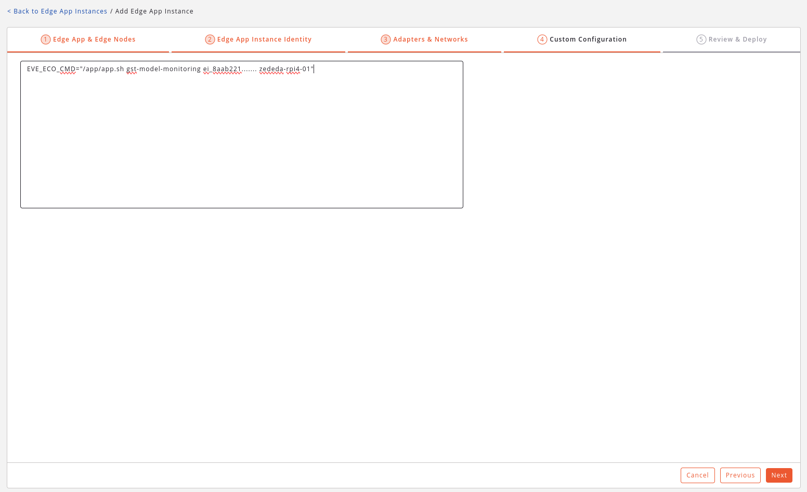

For this use the following configuration:
```
EVE_ECO_CMD="/app/app.sh gst-model-monitoring <EI_API KEY> <DEVICE_NAME>"
```

Finally, we can review and deploy the app:
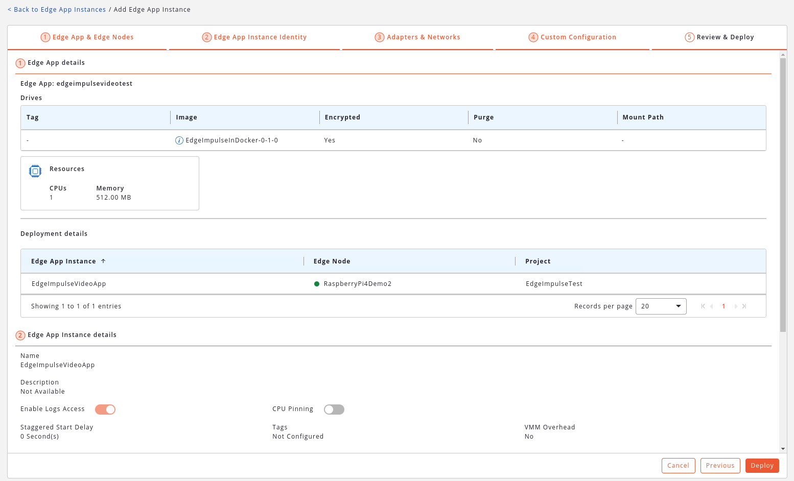

It takes a couple of minutes until the container image is fully downloaded, a volume is create and the app is booted. During this time the Edge App Instance will go through various states, and in the end it should become online:
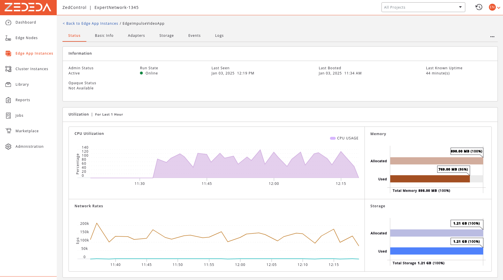

### Edge Impulse Model Monitoring

Managing large fleets of Edge Devices can get complex. The ZEDEDA Cloud solves this by offering a centralized platform that makes managing Edge Devices and Apps easy.

The ZEDEDA platform however does not have insights on what our Edge Apps are actually doing. With Edge ML apps is particularly important to get insights about our model's performance in real life.

Up until recently, in Edge Impulse implementing monitoring of production Edge ML apps was left to the users. 

Now, Edge Impulse is working on a new set of [Model Monitoring](https://edgeimpulse.com/industrial-new-features) features, mean to enable deployment and monitoring of EdgeML apps.

With Model Monitoring enabled on our ZEDEDA Edge App we can the following features:
1. New devices running the Edge App are automatically populated in the Devices tab in EI Studio
2. Using Live Inference we can monitor / debug the AI models running on the Edge Device in real-time
3. We can push new model version to the Edge Devices, without the need to restart or redeploy the Edge App.

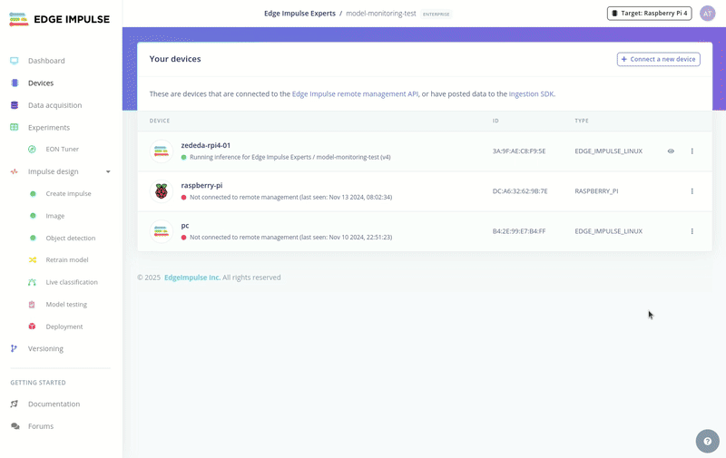

Note: Model Monitoring is still experimental.


